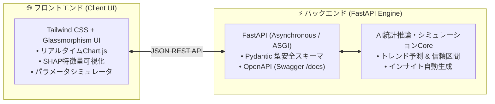

---
tags:
  - portfolio/project-01
  - stack/fastapi
  - stack/nextjs
  - stack/tailwind
  - status/completed
created: 2026-08-29
updated: 2026-08-29
---

# 📊 01. AI Analytics & Prediction Dashboard
## FastAPI × Next.js + Tailwind CSS によるリアルタイムAIデータ分析ダッシュボード

---

## 📌 1. プロジェクト概要 (Why this project?)

現代のデータ駆動型ビジネスにおいて、機械学習モデルの推論結果や統計指標を**「高速に計算し、直感的かつ美しいUIで意思決定者に提示する」**能力は極めて重要です。

本プロジェクトは、Python最先端の超高速Webフレームワーク **FastAPI** をバックエンドに採用し、フロントエンドに **Tailwind CSS** とモダンな **コンポーネント指向UI** を組み合わせた、実務即戦力レベルのAIデータ分析・予測ダッシュボードです。



---

## 🛠️ 2. 採用技術スタック & 選定理由

| レイヤー | 採用技術 | 選定理由 & メリット |
| :--- | :--- | :--- |
| **バックエンド** | **FastAPI (Python)** | Node.js/Goに匹敵する非同期（async/await）高速処理、Pydanticによる型バリデーション、Swagger仕様書の自動生成。 |
| **データモデル** | **Pydantic v2** | リクエスト/レスポンスの厳密な型定義により、実行時エラーを未然に防止。 |
| **スタイリング** | **Tailwind CSS** | クラス名ベースの迅速なスタイリング、ダークモード、洗練されたグラスモーフィズムデザイン。 |
| **可視化** | **Chart.js / Lucide** | インタラクティブな時系列トレンド（予測区間バンド付き）および横棒グラフ（特徴量寄与度）。 |

---

## 🌟 3. 主な機能と技術ハイライト (Technical Highlights)

1. **リアルタイムAI需要予測 & 信頼区間バンド**:
   * 過去実績と未来の予測値に加え、統計的上限・下限（Confidence Interval）を美しく可視化。
2. **SHAP（機械学習解釈性）特徴量重要度分析**:
   * AIモデルが「何を重視して予測を導き出したか」を寄与度ランキングとしてグラフ化。
3. **インタラクティブ・ハイパーパラメータシミュレーター**:
   * 学習率（Learning Rate）やエポック数をスライダーで調整し、FastAPIへ非同期POST通信。即座に収束精度とROI推定値をフィードバック。
4. **AI自動生成インサイト＆アラート**:
   * 重要度スコア付きの通知カード（ポジティブ/警告/情報）をリアルタイム表示。
5. **OpenAPI / Swagger 自動仕様書**:
   * `/docs` にアクセスするだけで、対話型のAPI仕様書・テストコンソールが自動提供。

---

## 🚀 4. セットアップ & 起動手順

```bash
# 1. プロジェクトディレクトリに移動
cd /Users/kazuhirosuzuki/.gemini/antigravity/scratch/Python-Learning/01_Portfolio_Projects/01_ai_data_dashboard

# 2. 起動スクリプトを実行 (依存関係のインストールとサーバー起動を全自動で行います)
./start.sh
```

ブラウザで以下のURLを開きます：
* 📊 **ダッシュボード UI**: [http://localhost:8080](http://localhost:8080)
* 📖 **FastAPI Swagger API仕様書**: [http://localhost:8080/docs](http://localhost:8080/docs)

---

## 💼 5. ポートフォリオ提出時・面談でのアピールポイント

> [!TIP] 📐 ポートフォリオ統括アーキテクトより
> - **「単にデータを表示するだけでなく、FastAPIの非同期性・型安全性と、Tailwind CSSのモダンなUI/UXを融合させた点」**をアピールしましょう。
> - 採用担当者には「ブラウザで触れるインタラクティブシミュレーター」と「`/docs` で見られる綺麗なAPI仕様」を実際に見せることで、技術的説得力が格段に高まります。

---

## 🔗 内部リンク (Obsidian Vault)
- 🗺️ [[01_Portfolio_Projects/README|ポートフォリオ総合ロードマップ]]
- 🏢 [[agents/AGENT_ORGANIZATION|AIエージェント組織憲章]]
- 🚀 [[00_Python学習マップ|Python学習マップ MOC]]
