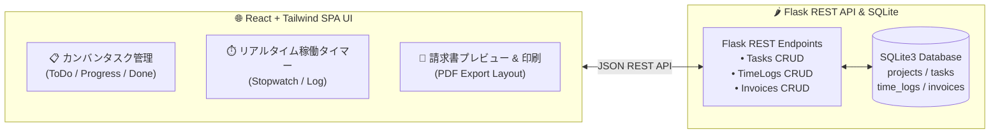
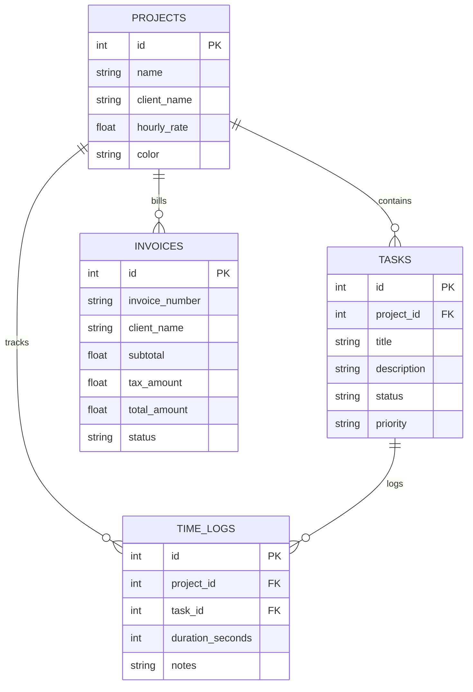

---
tags:
  - portfolio/project-02
  - stack/react
  - stack/tailwind
  - stack/flask
  - stack/sqlite
  - status/completed
created: 2026-08-29
updated: 2026-08-29
---

# 📋 02. TaskFlow & Invoice SaaS
## React × Tailwind CSS × Flask / SQLite によるタスク・稼働時間・請求書一元管理SaaS

---

## 📌 1. プロジェクト概要 (Why this project?)

フリーランスや受託開発チーム、リモートワーカーにとって、**「タスクの進行」「日々の実稼働時間の計測」「月末の請求書作成」が別々のツールに分散していること**は大きな業務負荷です。

本プロジェクトは、この3つの業務フローを1つのダッシュボードに統合し、**「タイマーで記録した稼働時間からワンクリックで時給計算された美しい請求書（PDF印刷対応）を発行できる」実務直結型のマイクロSaaS**です。



---

## 🛠️ 2. 採用技術スタック & 選定理由

| レイヤー | 採用技術 | 選定理由 & メリット |
| :--- | :--- | :--- |
| **フロントエンド** | **React (SPA) + Tailwind CSS** | コンポーネント指向による柔軟なUI設計、動的カンバン操作、リアルタイムタイマー状態管理。 |
| **スタイリング** | **Tailwind CSS + Glassmorphism** | 直感的なダークモードSaaS UI、レスポンシブグリッド、印刷専用CSS（`@media print`）。 |
| **バックエンド** | **Flask (Python REST API)** | 軽量かつ高機能なAPIルーティング、CORS対応、高速なJSONシリアライズ。 |
| **データベース** | **SQLite3** | リレーショナル構造（外部キー制約、自動インデックス）をゼロコンフィグで提供。 |

---

## 🌟 3. 主な機能と技術ハイライト (Technical Highlights)

1. **カンバン式タスクマネージャー**:
   * 進捗ステータス（ToDo / In Progress / Done）の更新、優先度バッジ、プロジェクト別タグ付け。
2. **リアルタイム稼働タイマー（タイムトラッカー）**:
   * 1秒刻みで稼働時間をストップウォッチ計測。停止時に作業メモとともにSQLiteへ即時永続化。
3. **プロジェクト & 時給（Hourly Rate）管理**:
   * クライアントごとの契約時給を設定し、稼働時間に対する売上見込額をリアルタイム自動算出。
4. **ワンクリック請求書（Invoice）自動作成 & 印刷対応**:
   * 記録された稼働ログから品目・稼働時間・時給・消費税（10%）を自動計算。
   * 日本の商習慣に準拠した美しい請求書レイアウトで、ブラウザからそのまま **「PDF保存 / 印刷」** が可能。

---

## 📊 4. データベース設計 (ER Diagram)



---

## 🚀 5. セットアップ & 起動手順

```bash
# 1. ディレクトリに移動
cd /Users/kazuhirosuzuki/Desktop/01_Portfolio_Projects/02_task_billing_saas

# 2. 起動スクリプトを実行
./start.sh
```

ブラウザで [http://localhost:5055](http://localhost:5055) を開くと、SaaSダッシュボードが立ち上がります！

---

## 💼 6. ポートフォリオ提出・面談でのアピールポイント

> [!TIP] 📐 ポートフォリオ統括アーキテクトより
> - **「単なる画面モックではなく、データベース永続化・CRUD・請求計算ロジック・印刷機能まで一気通貫で設計・実装した点」**をアピールできます。
> - 実際の業務で即使えるレベルの完成度（リアルタイムタイマーと請求書の連動）を見せることで、実務適応力の高さを強く印象付けられます。

---

## 🔗 内部リンク (Obsidian Vault)
- 🗺️ [[00_ポートフォリオ総合マップ|ポートフォリオ総合ダッシュボード]]
- ⚡ [[10_Concepts/FlaskとREST_APIの基礎|FlaskとREST APIの基礎]]
- ⚛️ [[10_Concepts/Reactによる状態管理とタイマー設計|Reactによる状態管理とタイマー設計]]
- 📐 [[10_Concepts/SQLiteによるデータモデリング|SQLiteによるデータモデリング]]
