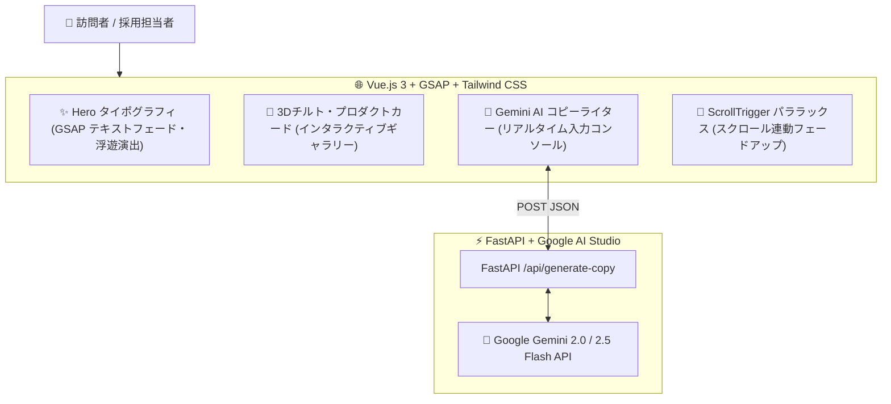

---
tags:
  - portfolio/project-03
  - stack/vue3
  - stack/gsap
  - stack/tailwind
  - stack/gemini-api
  - status/completed
created: 2026-08-29
updated: 2026-08-29
---

# ✨ 03. AURA - Interactive Creative Brand LP
## Vue.js 3 × GSAP ScrollTrigger × Tailwind CSS × Gemini 2.0 API による次世代ブランドランディングページ

---

## 📌 1. プロジェクト概要 (Why this project?)

Webサイトの第一印象（ファーストビュー）において、**「ユーザーの心を一瞬で掴むデザイン性」と「滑らかで心地よいアニメーション（マイクロインタラクション）」**は、ブランドの価値を劇的に高めます。

本プロジェクトは、**Vue.js 3 (Composition API)** と **GSAP (GreenSock Animation Platform)** を駆使した最高峰のモーションデザインに加え、**Google AI Studio の Gemini 2.0 API** をバックエンドに直結。
訪問者がキーワードを入力すると、**「AIがリアルタイムで洗練されたキャッチコピーを考案し、LP全体のHeroセクションが動的に書き換わる」**という最先端のインタラクティブ体験を実装しています。



---

## 🛠️ 2. 採用技術スタック & 選定理由

| レイヤー | 採用技術 | 選定理由 & メリット |
| :--- | :--- | :--- |
| **フロントエンド** | **Vue.js 3 (Composition API)** | リアクティブな状態管理（`ref`, `reactive`）により、AIが生成したテキストをDOMへ瞬時に滑らかに反映。 |
| **アニメーション** | **GSAP 3 (ScrollTrigger)** | CSSアニメーションでは不可能な精密なスクロール連動、要素のフェードアップ、イージング制御。 |
| **スタイリング** | **Tailwind CSS** | ダークラグジュアリー（深黒 × ゴールド × インディゴ）、グラスモーフィズム（`backdrop-blur`）。 |
| **AIバックエンド** | **FastAPI + Gemini API** | Google AI Studio (Gemini 2.5 Flash) を呼び出し、構造化されたJSONコピーライティングを即座に返却。 |

---

## 🌟 3. 主な機能と技術ハイライト (Technical Highlights)

1. **GSAP による洗練されたオープニング & スクロール演出**:
   * ページ読み込み時の文字分解フェードイン、スクロールに合わせた要素の自然な浮遊（ScrollTrigger）。
2. **マウス追従グローエフェクト (CSS Custom Property + JS)**:
   * マウスカーソルの位置に合わせて背景に柔らかな光が追従するラグジュアリーな質感。
3. **🌟 Gemini 2.0 リアルタイム・コピーライターコンソール**:
   * ブランド名や特徴を入力すると、Gemini API が瞬時に「タグライン」「メイン見出し」「ブランドストーリー」を自動考案し、Heroセクションをリアルタイムに更新。
4. **3D チルト・プロダクトカード**:
   * マウスホバーで立体的な奥行きを感じさせるカードコンポーネント。

---

## 🚀 4. セットアップ & 起動手順

```bash
# 1. ディレクトリに移動
cd /Users/kazuhirosuzuki/Desktop/01_Portfolio_Projects/03_creative_brand_lp

# 2. 起動スクリプトを実行
./start.sh
```

ブラウザで [http://localhost:8090](http://localhost:8090) を開くと、クリエイティブLPが起動します！

---

## 💼 5. ポートフォリオ提出・面談でのアピールポイント

> [!TIP] 🎨 UI/UX＆Tailwindスペシャリストより
> - **「単に綺麗なLPを作るだけでなく、Vue 3のリアクティビティとGemini APIを融合させ、ユーザーが触って楽しめるインタラクティブなプロダクトに仕上げた点」**をアピールできます。
> - デザイン重視の受託制作からモダンなAI Webアプリケーション開発まで、幅広い領域で即戦力として活躍できるスキルを証明できます。

---

## 🔗 内部リンク (Obsidian Vault)
- 🗺️ [[00_ポートフォリオ総合マップ|ポートフォリオ総合ダッシュボード]]
- 🟢 [[10_Concepts/Vue3とComposition_APIの基礎|Vue.js 3とComposition APIの基礎]]
- 🎬 [[10_Concepts/GSAPによるスクロール連動アニメーション|GSAPによるスクロール連動アニメーション]]
- 🧠 [[10_Concepts/Gemini_APIによるリアルタイム生成連携|Gemini APIによるリアルタイム生成連携]]
