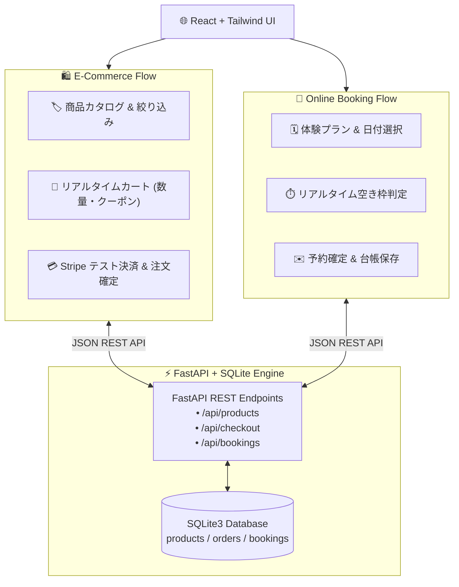
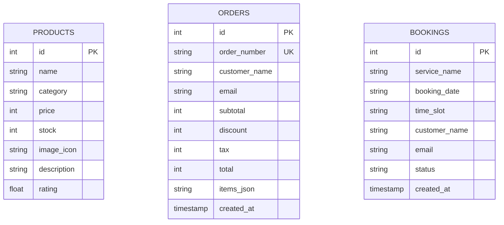

---
tags:
  - portfolio/project-04
  - stack/react
  - stack/tailwind
  - stack/fastapi
  - stack/sqlite
  - stack/stripe
  - status/completed
created: 2026-08-29
updated: 2026-08-29
---

# 🛍️ 04. LUMEN - Modern E-Commerce & Booking Platform
## React × Tailwind CSS × FastAPI / SQLite による商品EC・リアルタイム日時予約・Stripe決済統合プラットフォーム

---

## 📌 1. プロジェクト概要 (Why this project?)

現代のD2Cブランドや体験型サロン・スタジオにおいて、**「物販（EC）と体験サービス（予約）がシームレスに統合されたWeb体験」**は売上と顧客エンゲージメントを最大化する鍵です。

本プロジェクトは、**「商品販売」「スライドインカート＆クーポン割引」「カレンダーによる空き枠日時予約」「Stripe決済シミュレーション」「SQLiteによる在庫連動」**を一気通貫で実装した、実務ビジネス直結型のフルスタックWebアプリケーションです。



---

## 🛠️ 2. 採用技術スタック & 選定理由

| レイヤー | 採用技術 | 選定理由 & メリット |
| :--- | :--- | :--- |
| **フロントエンド** | **React (SPA) + Tailwind CSS** | 動的なカート状態（`useState`, `useMemo`）、スムーズなドロワー開閉、清潔感あふれるUI設計。 |
| **バックエンド** | **FastAPI (Python)** | 高速な非同期処理、Pydanticによる厳格なリクエストバリデーション（型安全）。 |
| **データベース** | **SQLite3** | トランザクション処理（注文時の在庫引き落とし、予約枠の重複防止）。 |
| **決済基盤** | **Stripe 決済シミュレータ** | 実務のクレジットカード決済フロー（カード入力、トークン化、決済完了）を再現。 |

---

## 🌟 3. 主な機能と技術ハイライト (Technical Highlights)

1. **商品カタログ & リアルタイム在庫管理**:
   * カテゴリーフィルター（Lifestyle / Wellness / Audio）、価格ソート、残りわずかバッジ表示。
2. **スマート・ショッピングカート**:
   * スライドイン式のドロワーカート、数量増減時の在庫上限チェック、クーポンコード（`SPECIAL10` で10%割引）の自動計算。
3. **オンライン日時予約システム (Booking Engine)**:
   * プライベート試聴会やワークショップの日時選択、リアルタイム空き枠判定（満席スロットの自動無効化）。
4. **Stripe 決済シミュレーション**:
   * クレジットカード入力フォーム、注文ID（`ORD-YYYYMMDD-XXXX`）の発行、在庫の即時引き落とし。

---

## 📊 4. データベース設計 (ER Diagram)



---

## 🚀 5. セットアップ & 起動手順

```bash
# 1. ディレクトリに移動
cd /Users/kazuhirosuzuki/Desktop/01_Portfolio_Projects/04_modern_ec_booking

# 2. 起動スクリプトを実行
./start.sh
```

ブラウザで [http://localhost:8095](http://localhost:8095) を開くと、EC＆予約プラットフォームが立ち上がります！

---

## 💼 6. ポートフォリオ提出・面談でのアピールポイント

> [!TIP] ⚡ フルスタック＆AIエンジニアより
> - **「単なる画面モックではなく、在庫トランザクション、クーポン計算、空き枠バリデーション、決済完了までの一連の業務ロジックを破綻なく実装した点」**をアピールできます。
> - 実務のWeb開発やEC・予約システム案件において、即戦力として設計・開発を主導できる信頼感を獲得できます。

---

## 🔗 内部リンク (Obsidian Vault)
- 🗺️ [[00_ポートフォリオ総合マップ|ポートフォリオ総合ダッシュボード]]
- 🛍️ [[10_Concepts/ECカートと在庫管理のトランザクション設計|ECカートと在庫管理のトランザクション設計]]
- 📅 [[10_Concepts/オンライン予約システムの空き枠判定ロジック|オンライン予約システムの空き枠判定ロジック]]
- 💳 [[10_Concepts/Stripe決済API連携の基本フロー|Stripe決済API連携の基本フロー]]
