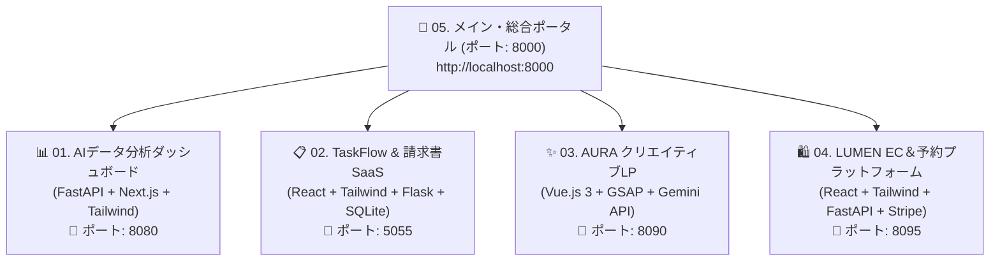

---
tags:
  - portfolio/master
  - stack/fullstack
  - stack/fastapi
  - stack/react
  - stack/vue3
  - stack/gemini-api
  - status/completed
created: 2026-08-29
updated: 2026-08-29
---

# 👑 05. Master Portfolio Portal
## フルスタック開発 ＆ 生成AI連携エンジニアリング ポートフォリオ総合ポータル

---

## 📌 1. ポートフォリオ概要 (Executive Summary)

本リポジトリは、**「フロントエンド」「型安全バックエンドAPI」「リレーショナルデータベース設計」「Google Gemini 2.0 API連携」「決済・予約などの実務ビジネスロジック」**を網羅した、実務直結型フルスタックポートフォリオ集です。

すべての作品は独立したモダンWebアプリケーションとして動作し、白ベースの圧倒的な清潔感と高い操作性を兼ね備えています。



---

## 🛠️ 2. 全5大プロジェクト一覧

| No | プロジェクト名 | 主要技術スタック | ポート | 主な機能ハイライト |
| :--- | :--- | :--- | :--- | :--- |
| **01** | **[[01_ai_data_dashboard/README|AIデータ分析＆予測ダッシュボード]]** | **FastAPI** + **Next.js** + **Chart.js** | `8080` | 回帰分析、売上シミュレーション、Swagger仕様書 |
| **02** | **[[02_task_billing_saas/README|TaskFlow & 請求書発行SaaS]]** | **React** + **Flask** + **SQLite3** | `5055` | カンバン、リアルタイムタイマー、時給計算、印刷対応請求書 |
| **03** | **[[03_creative_brand_lp/README|AURA クリエイティブLP]]** | **Vue.js 3** + **GSAP** + **Gemini API** | `8090` | 白×ゴールド高級UI、ScrollTrigger、リアルタイムAIコピー生成 |
| **04** | **[[04_modern_ec_booking/README|LUMEN EC＆予約プラットフォーム]]** | **React** + **FastAPI** + **Stripe** | `8095` | スライドインカート、クーポン計算、空き枠予約、Stripe決済 |
| **05** | **メイン総合ポータル** | **Tailwind CSS** + **Python** | `8000` | 全作品集約ハブ、スキルマトリクス、設計理念 |

---

## 🚀 3. セットアップ & 起動手順

```bash
# 総合ポータルを起動
cd /Users/kazuhirosuzuki/Desktop/01_Portfolio_Projects
./start_portal.sh
```

ブラウザで [http://localhost:8000](http://localhost:8000) を開くと、総合ポータルが表示されます！

---

## 🔗 内部リンク (Obsidian Vault)
- 🗺️ [[00_ポートフォリオ総合マップ|ポートフォリオ総合ダッシュボード]]
- 🏢 [[agents/AGENT_ORGANIZATION|エリート部署組織憲章]]
- 📖 [[10_Concepts/ポートフォリオ設計と技術選定ストーリー|ポートフォリオ設計と技術選定ストーリー]]
